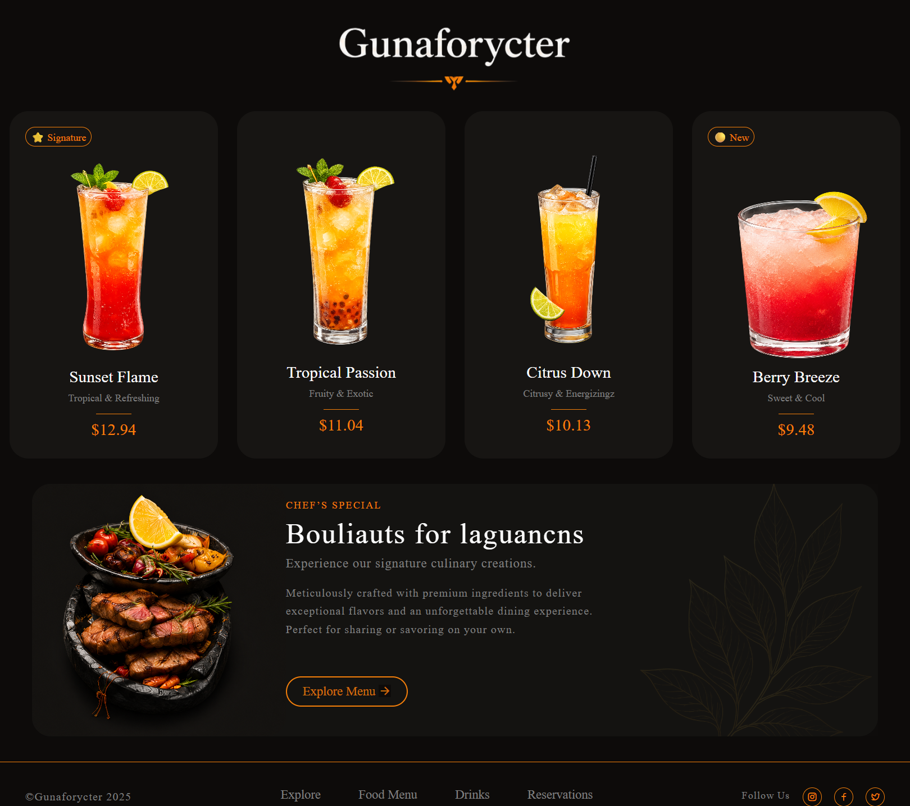
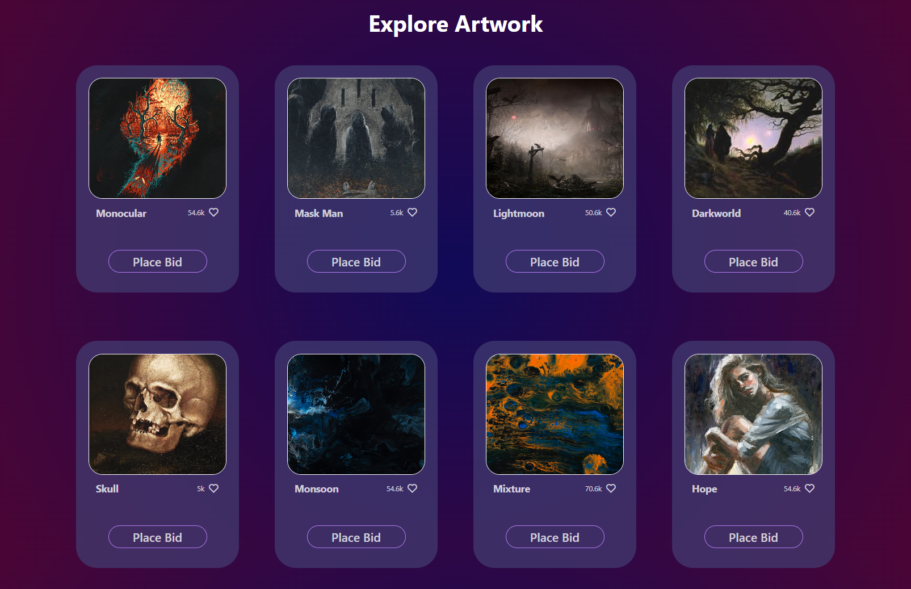
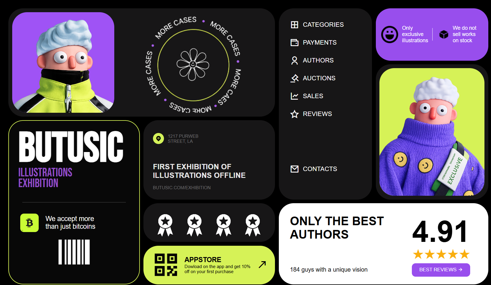

# 🎓 Cohort 3 - Web Development Assignments

Welcome to my repository for **Cohort 3**! This repository serves as a centralized hub for all the projects, challenges, and design assignments I complete throughout the program. 

Every assignment is organized into its own subdirectory, with live static page deployments automatically hosted via GitHub Pages.

---


## 🌐 Live Portfolio & Project Dashboard

* **GitHub Pages Live Link:** [https://md-alihaider.github.io/cohort-3/](https://md-alihaider.github.io/cohort-3/)

> 💡 **Tip:** To view any individual assignment, simply navigate to `https://md-alihaider.github.io/cohort-3/folder-name/`.

---

## 📂 Assignment Directory

| Assignment Name | Tech Stack | Live Preview | Source Code | Screenshot |
| :--- | :--- | :--- | :--- | :--- |
| **01. CSS Design Assignment 1** | HTML5, CSS3 | [Live Demo 🔗](https://md-alihaider.github.io/cohort-3/Assingment1-Css) | [Code 📂](./Assingment1-Css/) | [View 📸](#01-css-design-assignment-1-preview) |
| **02. CSS Design Assignment 2 (Design 1)** | HTML5, CSS3 | [Live Demo 🔗](https://md-alihaider.github.io/cohort-3/Assingment2-Css/Design1/) | [Code 📂](./Assingment2-Css/Design1/) | [View 📸](#02-css-design-assignment-2-design-1-preview) |
| **03. CSS Design Assignment 2 (Design 2)** | HTML5, CSS3 | [Live Demo 🔗](https://md-alihaider.github.io/cohort-3/Assingment2-Css/Design2/) | [Code 📂](./Assingment2-Css/Design2/) | [View 📸](#03-css-design-assignment-2-design-2-preview) |
| **04. CSS Design Assignment 2 (Design 3)** | HTML5, CSS3 | [Live Demo 🔗](https://md-alihaider.github.io/cohort-3/Assingment2-Css/Design3/) | [Code 📂](./Assingment2-Css/Design3/) | [View 📸](#04-css-design-assignment-2-design-3-preview) |
| **05. CSS Design Assignment 3 (Design 1)** | HTML5, CSS3 | [Live Demo 🔗](https://md-alihaider.github.io/cohort-3/Assignment3-Css/Design1/) | [Code 📂](Assignment3-Css/Design1) | [View 📸](#05-css-design-assignment-3-design-1-preview) |
| **06. CSS Design Assignment 4 (Design 1)** | HTML5, CSS3 | [Live Demo 🔗](https://md-alihaider.github.io/cohort-3/Assignment4-Css/Design1/) | [Code 📂](Assignment4-Css/Design1) | [View 📸](#06-css-design-assignment-4-design-1-preview) |

---

## 🖼️ Assignment Previews

### 01. CSS Design Assignment 1 Preview
*A beautifully styled, responsive layout built using modern CSS practices.*


---

### 02. CSS Design Assignment 2 (Design 1) Preview
*Clean and modern UI design crafted with precision layout techniques.*


---

### 03. CSS Design Assignment 2 (Design 2) Preview
*An alternative modern layout emphasizing clean spacing and structured typography.*



---

### 04. CSS Design Assignment 2 (Design 3) Preview
*An elegant, editorial split-screen UI layout featuring interactive elements and a stunning centered glass display dome.*


---

### 05. CSS Design Assignment 3 (Design 1) Preview
*A visually balanced modern layout focused on typography, spacing, and component alignment.*



---

### 06. CSS Design Assignment 4 (Design 1) Preview
*A clean responsive interface featuring advanced CSS positioning and modern design aesthetics.*



---

## 🛠️ How to Run Locally

If you want to clone this repository and test the projects locally, follow these steps:

1. **Clone the repository:**
   ```bash
   git clone [https://github.com/md-alihaider/cohort-3.git](https://github.com/md-alihaider/cohort-3.git)
2.  **Navigate to the root directory:**

    ```bash
    cd cohort-3
    ```

3.  **Open an assignment:**
    - Open any assignment folder and launch `index.html` using a local server extension (like **Live Server** in VS Code).

---

<p align="center">Build with ❤️ by Md Ali Haider</p>
