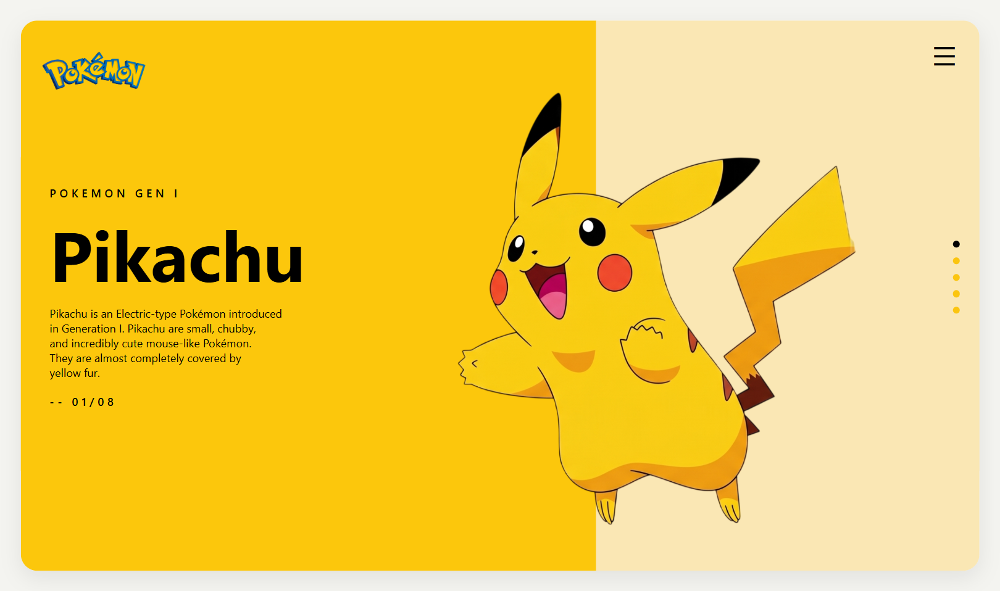
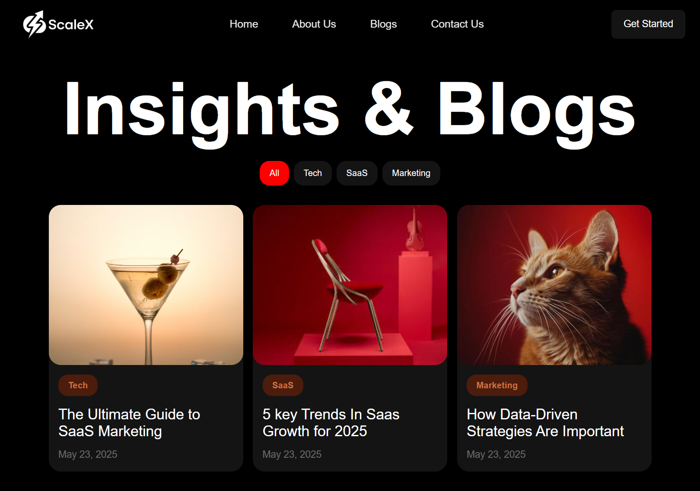
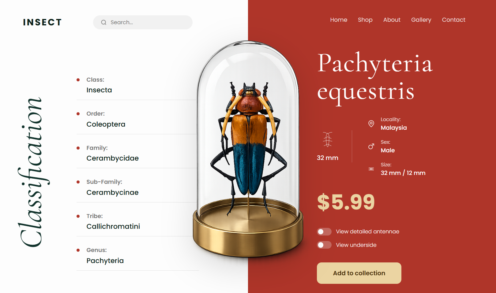
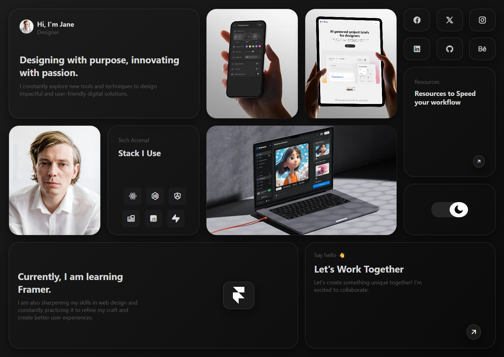
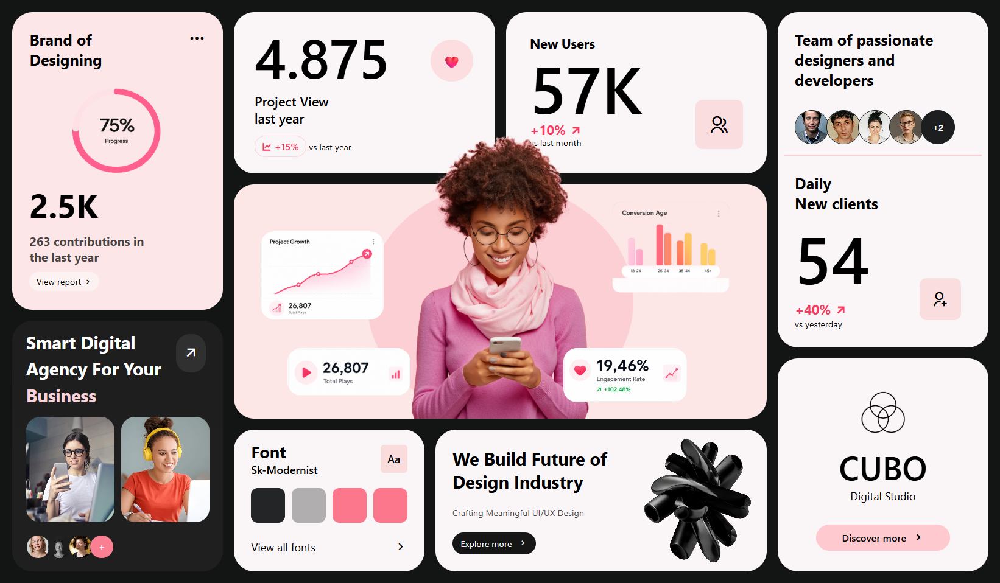
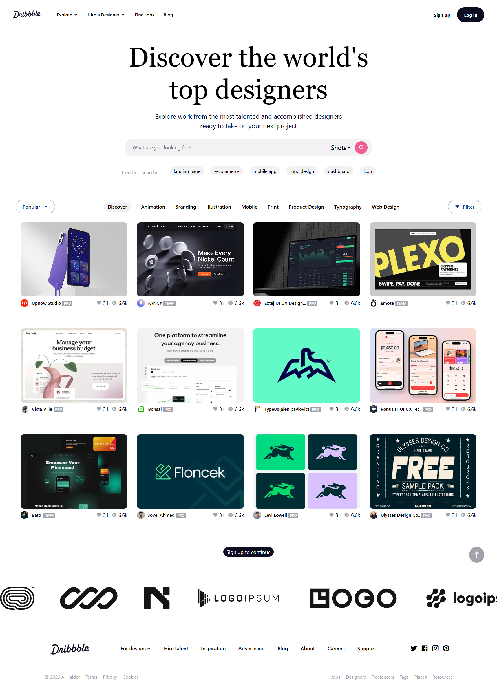

# 🎓 Cohort 3 – Web Development Assignments

Welcome to my repository for **Cohort 3**!  
This repository serves as a centralized hub for all the projects, challenges, and design assignments I complete throughout the program.

Each assignment is organized into its own subdirectory, with live deployments hosted using GitHub Pages.

---


---

# 🌐 Live Portfolio & Project Dashboard

- **GitHub Pages Live Link:**  
  https://md-alihaider.github.io/cohort-3/

> 💡 **Tip:** To open any assignment directly:
>
> `https://md-alihaider.github.io/cohort-3/folder-name/`

---

# 📂 Assignment Directory

| # | Assignment | Tech Stack | Live Preview | Source Code |
|---|---|---|---|---|
| 01 | CSS Design Assignment 1 | HTML5, CSS3 | [Live Demo 🔗](https://md-alihaider.github.io/cohort-3/Assingment1-Css/) | [Code 📂](./Assingment1-Css/) |
| 02 | CSS Design Assignment 2 – Design 1 | HTML5, CSS3 | [Live Demo 🔗](https://md-alihaider.github.io/cohort-3/Assingment2-Css/Design1/) | [Code 📂](./Assingment2-Css/Design1/) |
| 03 | CSS Design Assignment 2 – Design 2 | HTML5, CSS3 | [Live Demo 🔗](https://md-alihaider.github.io/cohort-3/Assingment2-Css/Design2/) | [Code 📂](./Assingment2-Css/Design2/) |
| 04 | CSS Design Assignment 2 – Design 3 | HTML5, CSS3 | [Live Demo 🔗](https://md-alihaider.github.io/cohort-3/Assingment2-Css/Design3/) | [Code 📂](./Assingment2-Css/Design3/) |
| 05 | CSS Design Assignment 3 – Design 1 | HTML5, CSS3 | [Live Demo 🔗](https://md-alihaider.github.io/cohort-3/Assignment3-Css/Design1/) | [Code 📂](./Assignment3-Css/Design1/) |
| 06 | CSS Design Assignment 4 – Design 1 | HTML5, CSS3 | [Live Demo 🔗](https://md-alihaider.github.io/cohort-3/Assignment4-Css/Design1/) | [Code 📂](./Assignment4-Css/Design1/) |
| 07 | CSS Design Assignment 4 – Design 2 | HTML5, CSS3 | [Live Demo 🔗](https://md-alihaider.github.io/cohort-3/Assignment4-Css/Design2/) | [Code 📂](./Assignment4-Css/Design2/) |
| 08 | CSS Design Assignment 4 – Design 3 | HTML5, CSS3 | [Live Demo 🔗](https://md-alihaider.github.io/cohort-3/Assignment4-Css/Design3/) | [Code 📂](./Assignment4-Css/Design3/) |
| 09 | CSS Design Assignment 5 – Design 1 | HTML5, CSS3 | [Live Demo 🔗](https://md-alihaider.github.io/cohort-3/Assignment5-Css/) | [Code 📂](./Assignment5-Css/) |

---

# 🖼️ Assignment Previews

## 01. CSS Design Assignment 1

*A beautifully styled responsive layout built using modern CSS practices.*



---

## 02. CSS Design Assignment 2 – Design 1

*Clean and modern UI crafted with precision layout techniques.*



---

## 03. CSS Design Assignment 2 – Design 2

*An alternative modern layout emphasizing spacing and typography.*


---

## 04. CSS Design Assignment 2 – Design 3

*An elegant editorial split-screen UI featuring interactive elements and a glass display dome.*



---

## 05. CSS Design Assignment 3 – Design 1

*A visually balanced modern layout focused on typography and spacing.*


---

## 06. CSS Design Assignment 4 – Design 1

*A clean responsive interface featuring advanced CSS positioning.*


---

## 07. CSS Design Assignment 4 – Design 2

*A modern responsive interface with polished layout aesthetics.*



---

## 08. CSS Design Assignment 4 – Design 3

*A sleek modern interface showcasing advanced CSS layouts.*



---

## 09. CSS Design Assignment 5 – Design 1

*A modern clean layout emphasizing responsive UI design.*



---

# 🛠️ How to Run Locally

Follow these steps to clone and run the projects locally.

## 1️⃣ Clone the Repository

```bash
git clone https://github.com/md-alihaider/cohort-3.git
```

## 2️⃣ Navigate to the Project Folder

```bash
cd cohort-3
```

## 3️⃣ Open Any Assignment

- Open any assignment folder.
- Launch the `index.html` file using a local server extension such as **Live Server** in VS Code.

---

<p align="center">
  Built with ❤️ by <strong>Md Ali Haider</strong>
</p>
